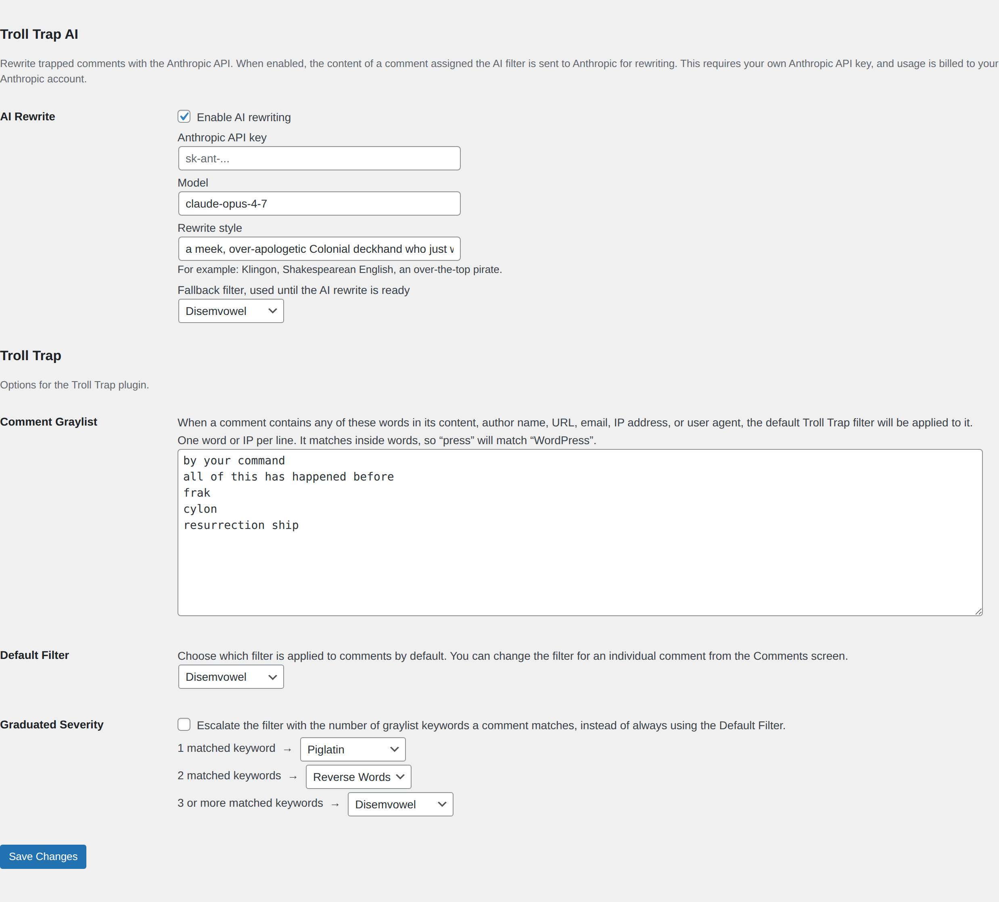
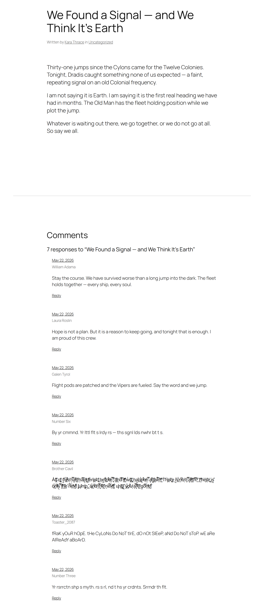
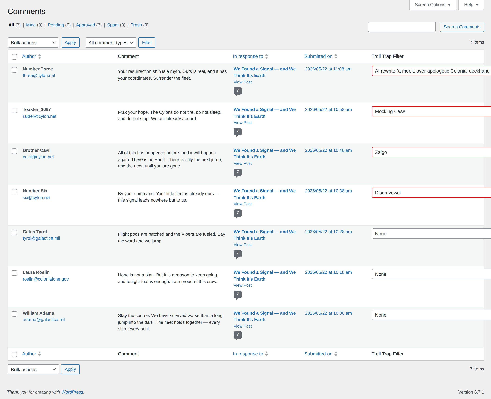

# Troll Trap

Troll Trap is a WordPress plugin that selectively filters and obfuscates comments based on keywords found in them — a moderation tier between `Approved` and `Unapproved` that keeps a comment visible while making its content inaccessible to readers.

> **Status: `1.0.0-alpha.1`** — an early release. The core features are in place and covered by CI across WordPress 6.5–nightly and PHP 8.0–8.3, but expect rough edges. Bug reports and feedback are very welcome.

Troll Trap's functionality is twofold.

## 1. Filter incoming comments automatically

The Comment Graylist under **Settings > Discussion > Troll Trap** works like WordPress' built-in Disallowed Comment Keys, checking the content, author name, URL, email, IP address and user agent of every new comment. When a comment matches a keyword, the default Troll Trap filter is applied to it automatically.

Each matched comment is transformed by one of eight built-in filters — pig latin, leetspeak, mocking case, uwu, reversed, ROT13, disemvowelled, or zalgo. Developers can register their own. An optional **AI Rewrite** filter can rewrite a comment in any style you describe (Klingon, Shakespearean, …) via the Anthropic API — opt-in, bring-your-own API key.

## 2. Filter existing comments manually

Apply the same obfuscation filters to any existing comment from the Comments panel — one comment at a time, or in bulk with the **Mark as Troll** and **Untrap** bulk actions.

Troll Trap creates a level of comment moderation between `Approved` and `Unapproved`, letting you keep a comment visible on your site while making its content inaccessible to your readers.

## Requirements

- WordPress 6.5 or newer
- PHP 8.0 or newer

## Contributing

Issues and pull requests are welcome.
